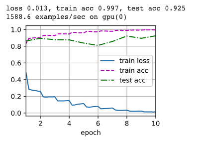

# Week 5 - Intro to Computer Vision with Deep Learning
# ResNets
In this week's assignment we will be building our version of the ResNet, first presented by [He *et al.* 2015](https://arxiv.org/pdf/1512.03385.pdf).
We will be using the MXNET library to create our own Residual layer and then re-creating the ResNet-19 described in the original paper.
Following that we will train the model on the MNIST dataset and look at the performance.

Image of ResNet training summary.

# AlexNet Classifier for Diabetic Retinopathy (DR)
This repo contains the small images which are eye scan of patients which can be spli
