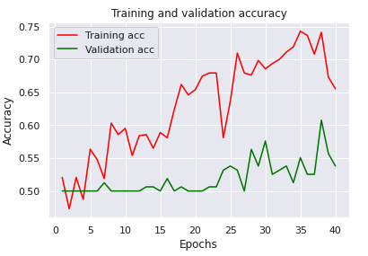
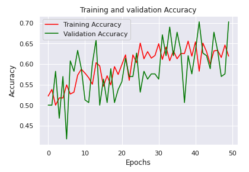

# Week 5 - Intro to Computer Vision with Deep Learning
# ResNets
In this week's assignment we will be building our version of the ResNet, first presented by [He *et al.* 2015](https://arxiv.org/pdf/1512.03385.pdf).
We will be using the MXNET library to create our own Residual layer and then re-creating the ResNet-19 described in the original paper.
Following that we will train the model on the MNIST dataset and look at the performance.

Image of ResNet training summary.


# AlexNet Classifier for Diabetic Retinopathy (DR)
In this part of the project we build a AlexNet-inspired neural network to classify patients into those who have DR and those who do not.
In this repo you will find the dataset of images (stored with Git LFS) located in the ```models``` directory. The ```.h5``` file contains 
over 1000 images split between 4 classes: No DR, Light DR, Medium DR and Severe DR. The goal of the exercise is to see if we can build a classifier
that would perform substantially well at figuring out whether the patient, from whom the scan came from, has DR or not.

One thing that we do is compare the performance of AlexNet trained on "just" the images contained within the dataset, to that of AlexNet trained with data augmentation where we apply random manipulations to the images in the original dataset. Looking at the images below we can see that data augmentation may improve validation accuracy. However, as we can see the validation accuracy fluctuates quite a bit and hence we should be careful when making any definitive statements. 

### No Data Augmentation



### With Data Augmentation



When we examine the loss on the test set, we observe that the model trained with the augmented images performs about 5% better than the model trained with the standard dataset (58% vs 53%). We also get very low recall (in the range 0.4 - 0.5). Most likely this is due to the low amount of data, since we only have around 1100 images to work with. 
